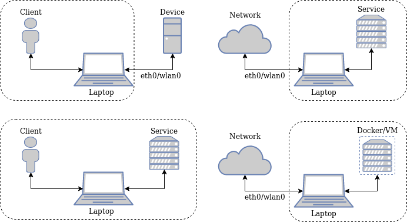
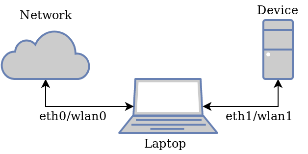
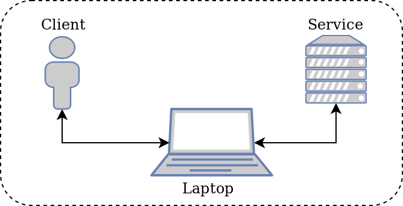

# How to intercept traffic

You will learn to intercept traffic based on linux interfaces.

## Use Case
- You need to intercept the traffic of a closed-source device
- You want to intercept traffic coming from a VM or Docker container
- You want to intercept traffic from a local service
- You want to intercept traffic from a local client to a device

## Scenarios
There are different scenarios that an attacker is confronted with.

### No Bridging Interfaces


In the above 4 scenarios is bridging of two interface not needed because the operating system is already taking care of the communication and can be easily intercepted by an attacker.

#### Bridging Interfaces


The most interesting scenario is when we have a device in the network and no direct access to communication of mentioned device with the network.
In this case we want to carry out a __Man-in-the-Middle__ attack.

##### Requirements
We will need an extra device such as a USB Ethernet/Wifi adapter.

##### Setup

There are several ways to bridge two interfaces and direct traffic from one to another:
1. `bridge-utils`
2. Modify `/etc/network/interfaces`

Source: [Link](https://wiki.debian.org/BridgeNetworkConnections)

###### Method 1: `bridge-utils`
Install `bridge-utils`:
```
sudo apt install bridge-utils
```
Create a bridge network:
```
sudo brctl addbr br0
```
You can check if the new bridge interface `br0` is no up and running with:
```
ifconfig
```
or the equivalent command:
```
ip addr show
```
Select the two interfaces that you want to connect from your list of interfaces (here `eth0` and `eth1`). Add the interfaces to your bridge interface `br0`:
```
sudo brctl addif br0 eth0 eth1
```

__Please note:__ These settings will not persist on reboot.

###### Method 2: Modify `/etc/network/interfaces`
Edit the file `/etc/network/interfaces`:
```
 # This file describes the network interfaces available on your system
 # and how to activate them. For more information, see interfaces(5).

 # The loopback network interface
 auto lo
 iface lo inet loopback

 # Set up interfaces manually, avoiding conflicts with, e.g., network manager
 iface eth0 inet manual

 iface eth1 inet manual

 # Bridge setup
 iface br0 inet dhcp
    bridge_ports eth0 eth1
```
Start the new bridge interface `br0` with:
```
sudo ifup br0
```
If there is no DHCP modify the `/etc/network/interfaces` in the following way:
```
 # This file describes the network interfaces available on your system
 # and how to activate them. For more information, see interfaces(5).

 # The loopback network interface
 auto lo br0
 iface lo inet loopback

 # Set up interfaces manually, avoiding conflicts with, e.g., network manager
 iface eth0 inet manual

 iface eth1 inet manual

 # Bridge setup
 iface br0 inet static
    bridge_ports eth0 eth1
        address 192.168.1.2
        broadcast 192.168.1.255
        netmask 255.255.255.0
        gateway 192.168.1.1
```
And start the bridge interface as described above.

###### Trouble Shooting
The following can help fix problems:
- Find out if the network has a _DHCP_ server or not, might be needed to set a static IP address.
- Sometimes the `network manager` messes with the configuration of network interfaces.


## Workshop
In this workshop we will simulate a scenario where the service is internal and client is internal. Because we need to minimize the effort/hardware for this workshop. Therefore, we will not demonstrate the bridging as described above.



The server can be started with the executable:
```
./tcp_server
```

As a client we will use the executable:
```
./alice_and_bob
```

## Challenge 01

1. Start `wireshark` and find the correct interface to intercept.
2. Find the tcp streams used to communicate between client and server.
3. What is alice and bobs password?
4. Describe the structure of the protocol.
