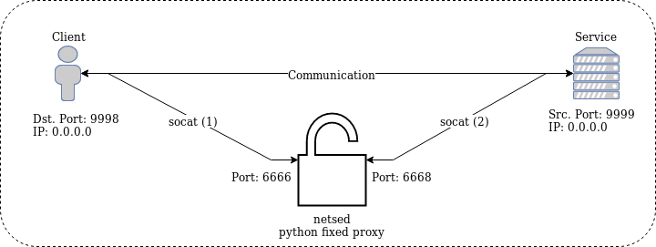

# How to modify traffic

## Protocol

The protocol consists of following parts:

__Get User ID__
```
42|username
```

__Login__
```
01|length|02|length_payload|03|user_id|password|04|MD5(01|length|02|length_payload|03|user_id|password)|ffff
```

## Advantages and Disadvantages

No that we understand the protocol a bit better we want to get admin rights!

There are two ways for it:
1. Create a new TCP connection and send over the modified payload
  - __Advantage:__ Very easy to do, easy to script and fuzz.
  - __Disadvantage:__ Not working/hard, if the protocol is complex and depends the order of the send requests.
2. Intercept the request on-the-fly and replace parts of the message.
  - __Advantage:__ Minimal overhead for complex protocols and small changes.
  - __Disadvantage:__ Complex setup.

## Method 1: New TCP Connection
The following will safe the TCP data to a file:
1. In `wireshark` use right-click on the `Data` and select `Export Packet Bytes...` (Ctrl+Shift-X) and save the data as a file.
2. Now you can send the data to service with netcat (`nc`):
```
nc 0.0.0.0 9999 < file.bin
```
3. To manipulate the exported binary file you can use a hex editor of your choice.

## Method 2: Intercept and Replace
This method will use two tools called `netsed` and `socat`.
1. `netsed`: can, based on match replace rules, modify tcp packets.
2. `socat`: can redirect the traffic to `netsed` and back to the network/service.



__Please note:__ We will start change the port for `./alice_and_bob -i 0.0.0.0 -p 9998` to port `9998`. Otherwise we cannot open the same port on the device. If you can't change the port you need to use `iptables` rules.

Setup `socat` to redirect traffic. At first open tree different terminals:
1. Open a listening port `9998` and redirect to `6666`
```
socat -v tcp4-listen:9998,reuseaddr,fork tcp4:0.0.0.0:6666
```
2. Start `netsed` and froward traffic from `6666` to `6665`
```
netsed tcp 6666 127.0.0.1 6665 's/match/replace/1'
```
The rule `'s/match/replace'` will replace the first `match` occurrence with `replace`. As a result the server will answer with the user id of the admin.

3. But at first we must route the traffic back to the service running on port `9999`.
```
socat -v tcp4-listen:6665,reuseaddr,fork tcp4:0.0.0.0:9999
```

# Challenge 02

1. What is the user id of the `admin`? Verify by resending a wireshark packet using both methods.
2. What is the password of the `admin`?
3. Login as the user `admin` using both methods. What is the flag?
